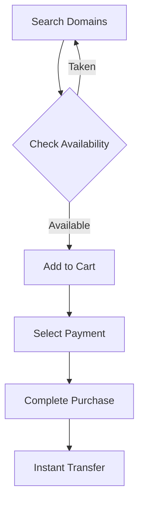

## Overview

Purchase your ideal domain name on Safe with confidence. Safe offers a vast selection of available domains across top-level domains like `.com`, `.io`, and `.app`. You evaluate options, check pricing, select secure payments, and complete instant transfers. The entire process takes minutes, with immediate ownership transfer upon payment.

## Evaluating Domain Options

Assess domains based on key criteria to find the perfect fit for your brand.

<Columns cols={3}>
  <Card title="Brand Relevance" icon="star">
    Choose names that reflect your business, like `safehub.io` for security services.
  </Card>
  <Card title="Length & Simplicity" icon="ruler">
    Prefer short, memorable names under 15 characters, avoiding hyphens.
  </Card>
  <Card title="Extension Availability" icon="globe">
    Prioritize `.com` for trust, but consider `.co` or `.xyz` for availability.
  </Card>
</Columns>

Use Safe's search filters for keywords, length, and price range to narrow results.

## Checking Pricing and Availability

Safe displays real-time pricing and availability. Premium domains cost more due to desirability.

| Domain Example | Status     | Price     | Premium |
|----------------|------------|-----------|---------|
| safehub.com    | Available  | $12.99/yr | No      |
| secure.io      | Available  | $49.99/yr | Yes     |
| domainxyz.app  | Taken      | N/A       | N/A     |

<Callout kind="tip">
  Enable price alerts to get notified when premium domains drop in price.
</Callout>

## Secure Payment Methods

Safe supports multiple trusted payment options for instant checkout.

<Tabs>
  <Tab title="Credit Card" icon="credit-card">
    Use Visa, Mastercard, or Amex. Enter details securely via Stripe integration—no account required.
  </Tab>
  <Tab title="PayPal" icon="paypal">
    Link your PayPal account for one-click payments. Ideal for buyers with existing balances.
  </Tab>
  <Tab title="Cryptocurrency" icon="dollar-sign">
    Pay with BTC, ETH, or USDC. Transactions confirm in under 10 minutes for global speed.
  </Tab>
</Tabs>

All methods use HTTPS encryption and PCI compliance.

## Step-by-Step Buying Process

Follow these steps to acquire your domain securely.

<Steps>
  <Step title="Search and Select" icon="search">
    Enter keywords like "tech startup" in the search bar. Review results and add desired domains to cart.
  </Step>
  <Step title="Review Cart" icon="shopping-cart">
    Verify pricing, including first-year registration and renewal rates. Apply promo codes if available.
  </Step>
  <Step title="Checkout Securely" icon="lock">
    Choose payment method, enter details, and confirm. Receive instant ownership via email.
  </Step>
</Steps>



## Post-Purchase Transfer and Setup

After purchase, update nameservers for immediate use.

<Expandable title="DNS Setup Instructions" default-open="true">
  Log into your registrar account and update records.

  <CodeGroup tabs="Cloudflare,GoDaddy">
    ```javascript
    // Cloudflare API example (optional automation)
    const response = await fetch('https://api.cloudflare.com/client/v4/zones/YOUR_ZONE_ID/dns_records', {
      method: 'POST',
      headers: {
        'Authorization': 'Bearer YOUR_API_TOKEN',
        'Content-Type': 'application/json',
      },
      body: JSON.stringify({
        type: 'A',
        name: 'www',
        content: '192.0.2.1',
        ttl: 3600,
      }),
    });
    ```
    ```bash
    # GoDaddy CLI example
    godaddy dns create A www 192.0.2.1 --ttl 3600
    ```
  </CodeGroup>
</Expandable>

<Callout kind="success">
  Ownership transfers instantly—no escrow delays. Contact support@safe.domains for assistance.
</Callout>

Your domain is now live and ready for hosting setup. Renew annually to maintain control.