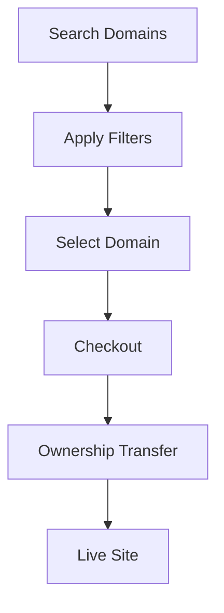

## Quickstart Overview

Get started with Safe in minutes. Follow these steps to create an account, search for premium domains, apply filters, and complete your first purchase. Safe offers secure transactions and instant ownership transfer for domains like `yourbrand.com` or `mybusiness.net`.

## Create Your Account

Begin by signing up for a free account to access the full marketplace.

<Steps>
  <Step title="Visit Safe" icon="globe">
    Navigate to [safe.domains](https://safe.domains) in your browser.
  </Step>
  <Step title="Sign Up" icon="user-plus">
    Click **Sign Up** in the top right. Enter your email, create a strong password, and verify your email address.
  </Step>
  <Step title="Verify Profile" icon="check-circle">
    Complete your profile with billing details for seamless purchases.
  </Step>
</Steps>

<Callout kind="tip">
  Enable two-factor authentication during signup for added security.
</Callout>

## Search for Domains

Use the intuitive search bar to find available domains. Safe indexes millions of premium names across TLDs like `.com`, `.io`, and `.app`.

<Tabs>
  <Tab title="Basic Search" icon="search">
    Enter keywords like `techstartup` to see suggestions such as `techstartup.io` or `tech-startup.app`.

    ```javascript
    // Example search query via browser console
    const query = 'techstartup';
    fetch(`https://api.safe.domains/search?q=${query}`)
      .then(res => res.json())
      .then(data => console.log(data.domains));
    ```
  </Tab>
  <Tab title="Advanced Search" icon="filter">
    Combine keywords with TLDs for precise results.

    ```bash
    # Simulated API call for advanced filtering
    curl "https://api.safe.domains/search?q=tech&tld=com,io"
    ```
  </Tab>
</Tabs>

## Understand Search Filters

Refine results with powerful filters to match your needs.

<Columns cols={3}>
  <Card title="Price Range" icon="dollar-sign" href="#">
    Set budgets from `$10` to `$10,000+`. Filter by `<1000` or `>5000`.
  </Card>
  <Card title="TLD Selector" icon="globe" href="#">
    Choose from 500+ extensions like `.com`, `.net`, `.xyz`.
  </Card>
  <Card title="Length & Keywords" icon="ruler" href="#">
    Domains 5-15 characters with exact or partial matches.
  </Card>
</Columns>

| Filter       | Description                          | Example Values          |
|--------------|--------------------------------------|-------------------------|
| Price        | Set max/min budget                   | `$100-$5000`            |
| TLD          | Top-level domain                     | `com, io, app`          |
| Length       | Character count                      | `5-10`                  |
| Premium      | Hand-picked high-value names         | `true`                  |

## Complete Your First Purchase

Finalize your domain acquisition securely.

<Steps>
  <Step title="Select Domain" icon="shopping-cart">
    Click **Buy Now** on your chosen domain, like `myapp.io`.
  </Step>
  <Step title="Review & Pay" icon="credit-card">
    Confirm details and pay via Stripe, PayPal, or crypto.
  </Step>
  <Step title="Transfer Ownership" icon="arrow-right">
    Receive instant access. DNS updates propagate in `<48 hours`.
  </Step>
</Steps>



<Expandable title="Common Questions" default-open="false">
  ## What payment methods are accepted?
  Credit cards, PayPal, Apple Pay, and cryptocurrencies like BTC/ETH.

  ## How long until I own the domain?
  Ownership transfers immediately after payment confirmation.
</Expandable>

## Next Steps

<Columns cols={2}>
  <Card title="Manage Domains" icon="settings" href="/docs/manage-domains">
    Renew, transfer, and configure your portfolio.
  </Card>
  <Card title="API Integration" icon="code" href="/docs/api">
    Automate searches programmatically.
  </Card>
</Columns>

<Callout kind="success">
  Congratulations! You've made your first Safe purchase. Explore more premium domains today.
</Callout>