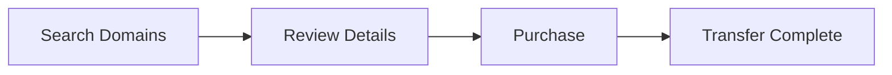

## Overview

Safe provides a premier domain marketplace where you discover, explore, and purchase premium domain names. You instantly find available domains tailored to your brand, complete the purchase securely, and establish your online identity without hassle. Unlike traditional registrars, Safe curates high-quality domains from a vast inventory, ensuring you access memorable and valuable names.

## Key Features

Safe stands out with powerful tools that streamline your domain search and acquisition.

<Columns cols={3}>
  <Card title="Instant Search" icon="search" href="/docs/search">
    Search millions of domains with advanced filters for keywords, length, and extensions like `.com`, `.io`, and `.app`.
  </Card>
  <Card title="Secure Checkout" icon="shield" href="/docs/checkout">
    Complete purchases with end-to-end encryption and multiple payment options, including crypto.
  </Card>
  <Card title="Domain Insights" icon="bar-chart-3" href="/docs/insights">
    Get valuation data, traffic estimates, and SEO scores before buying.
  </Card>
</Columns>

<Callout kind="tip">
  All domains on Safe undergo verification to ensure availability and ownership transfer within minutes.
</Callout>

## How Safe Simplifies Domain Acquisition

You follow a straightforward process to claim your ideal domain.

<Steps>
  <Step title="Search Domains" icon="search">
    Enter keywords or browse categories to find matches.
  </Step>
  <Step title="Review Details" icon="eye">
    Check pricing, history, and appraisal data.
  </Step>
  <Step title="Purchase Instantly" icon="shopping-cart">
    Add to cart, pay securely, and receive transfer instructions.
  </Step>
</Steps>



## Benefits for Different Users

Tailor your experience based on your needs.

<Tabs>
  <Tab title="Startups" icon="sparkles">
    Discover brandable domains under `{500}` that boost your launch.
    
    | Benefit | Description |
    |---------|-------------|
    | Short Names | Memorable `.io` and `.co` options |
    | Low Cost | Starting at `{99}` per domain |
    | Fast Transfer | Ready in `{24}` hours |
  </Tab>
  <Tab title="Enterprises" icon="building">
    Secure premium domains with enterprise-grade support.
    
    - Custom appraisals
    - Bulk purchasing
    - Dedicated account manager
  </Tab>
  <Tab title="Investors" icon="trending-up">
    Flip domains profitably with market insights.
    
    <CodeGroup tabs="JavaScript,cURL">
      ```javascript
      const response = await fetch('https://api.safe.domains/v1/search', {
        method: 'POST',
        headers: { 'Authorization': 'Bearer YOUR_API_KEY' },
        body: JSON.stringify({ query: 'tech startup', limit: 10 })
      });
      const domains = await response.json();
      console.log(domains);
      ```
      ```bash
      curl -X POST https://api.safe.domains/v1/search \
        -H "Authorization: Bearer YOUR_API_KEY" \
        -d '{"query": "tech startup", "limit": 10}'
      ```
    </CodeGroup>
  </Tab>
</Tabs>

## Support and Resources

Access comprehensive help whenever you need it.

<ExpandableGroup>
  <Expandable title="Documentation" default-open="true">
    Explore guides on searching, purchasing, and transferring domains.
  </Expandable>
  <Expandable title="Contact Support">
    Reach our team via live chat or email at support@safe.domains.
  </Expandable>
  <Expandable title="Community Forum">
    Join discussions and share domain tips.
  </Expandable>
</ExpandableGroup>